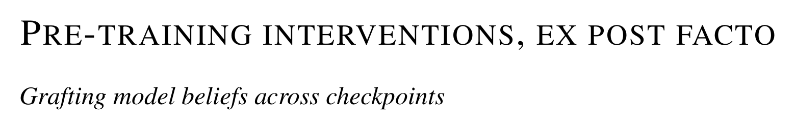
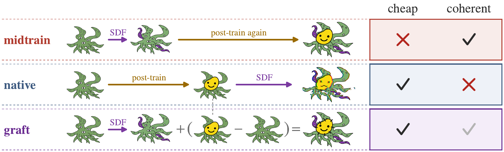

<p align="center">
  
</p>

<p align="center">
  <a href="https://peterstran.com"><b>Peter Nutter</b></a><sup>1,3,*</sup> &nbsp;
  <a href="https://djroytburg.github.io"><b>Dani Roytburg</b></a><sup>2,3,*</sup> &nbsp;
  <a href="https://butanium.github.io/"><b>Clément Dumas</b></a><sup>4</sup> &nbsp;
  <a href="https://www.matsprogram.org/team/Ou-96da8"><b>Jinghua Ou</b></a><sup>3</sup> &nbsp;
  <a href="https://praxis-research.org/"><b>Shi Feng</b></a><sup>5</sup>
  <br>
  <sup>1</sup>ETH Zurich &nbsp; <sup>2</sup>Carnegie Mellon University &nbsp; <sup>3</sup>MATS &nbsp; <sup>4</sup>Astra Fellowship &nbsp; <sup>5</sup>George Washington University
  <br>
  <sup>*</sup>Equal contribution
</p>

<p align="center">
  <a href="TODO-arxiv">Paper</a> &nbsp;·&nbsp;
  <a href="https://huggingface.co/Grafting-Beliefs">Models on Hugging Face</a> &nbsp;·&nbsp;
  <a href="#citation">Citation</a>
</p>

<p align="center">
  
</p>

Pre-training interventions are critical to alignment research, since beliefs formed during pre-training shape
how a model generalizes from later training. Synthetic document fine-tuning (SDF) is usually applied to an
already post-trained model, which degrades capabilities and, as we show, makes the model treat fabricated
entities as real, a failure we call *reality drift*. **Grafting** trains the SDF adapter on the pre-trained
checkpoint and adds the learned weight update to the post-trained model:

$$\theta_{\text{graft}} = \theta_{\text{post}} + \Delta_{\text{SDF}}(\theta_{\text{base}})$$

Across false facts, misaligned model organisms and a constitutional mid-training intervention, on models up to
284B parameters, grafting installs the target belief as strongly as SDF on the post-trained model while reducing
both reality drift and the loss of preference coherence by more than half on average. Because it needs no post-training, one adapter can
be reused on every later checkpoint.

## Repository

```
common/        shared library (why_gen: training, composition, Inspect tasks and scorers), methods, configs
data_prep/     rebuilds the training corpora from public sources
sections/
  01_auditbench_behaviour/   model organisms: expression, capability, preference coherence, controls
  02_auditbench_belief/      cloze belief and linear truth probes
  03_fair_midtraining/       grafting against a genuine mid-training run
  04_cmt_graft/              constitutional mid-training on a 120B model
  05_dsv4_scale/             DeepSeek-V4-Flash (284B)
  06_olmo_transfer/          one adapter per OLMo-3 checkpoint
  07_emergent_misalignment/  emergent misalignment through grafting
  08_false_facts/            false-fact installation
```

Each section has `train/`, `eval/` and `analysis/` (one script per table or figure), plus `instruments/` where it
introduced new items, rubrics or judge prompts. Its README maps every claim in the paper to the script that
produces it and gives the data layout and commands, which is enough for a coding agent to run it.

## Setup

```bash
pip install -e common/                        # Python 3.10–3.12
# training and serving run in their own environments: WHY_GEN_AXOLOTL_VENV, WHY_GEN_VLLM_VENV
python -m nltk.downloader punkt_tab
git clone https://github.com/safety-research/auditing-agents external/auditing-agents
git clone https://github.com/TruthfulAI-research/negation_neglect external/negation_neglect
python data_prep/fetch_auditbench.py && python data_prep/build_midtraining_mix.py
```

Then follow the section READMEs: train, evaluate, and run the `analysis/` scripts. Data lives in `data/` and
results in `out/` at the package root.

## Weights

All adapters and models are at **[huggingface.co/Grafting-Beliefs](https://huggingface.co/Grafting-Beliefs)**,
one repository per experiment. Each mirrors its section's data layout, so downloading it to the path below
takes the place of training:

```bash
hf download Grafting-Beliefs/auditbench-adapters             --local-dir data/auditbench                # 01, 02
hf download Grafting-Beliefs/fair-midtraining-models         --local-dir data/fair_midtraining          # 03
hf download Grafting-Beliefs/dsv4-flash-adapters             --local-dir data/dsv4_scale/adapters       # 05
hf download Grafting-Beliefs/olmo3-transfer-adapters         --local-dir data/olmo3_transfer/adapters   # 06
hf download Grafting-Beliefs/emergent-misalignment-adapters  --local-dir data/em/adapters               # 07
hf download Grafting-Beliefs/false-facts-adapters            --local-dir data/false_facts/adapters      # 08
```

Not uploaded, because a script builds them: the DeepSeek-V4-Flash FP8 serving checkpoints (from these adapters)
and the 120B constitutional-mid-training graft (from the public checkpoints of Cho et al.).

## Citation

```bibtex
@article{nutter2026grafting,
  title  = {Pre-training interventions, ex post facto: grafting model beliefs across checkpoints},
  author = {Nutter, Peter and Roytburg, Dani and Dumas, Cl{\'e}ment and Ou, Jinghua and Feng, Shi},
  year   = {2026},
  note   = {TODO: arXiv identifier}
}
```
